# ETH-BTC Trading Strategy

This is a **systematic trading strategy** designed to capture Bitcoin price movements using **asymmetric thresholds**:

| Action   | Threshold | Purpose                        |
| -------- | --------- | ------------------------------ |
| **Sell** | +7%       | Take profits on upward moves   |
| **Buy**  | -1%       | Re-enter after small pullbacks |

**How it works:**

1. **Buy BTC** with available capital (initial investment or reinvested profits).
2. **Sell BTC** when the price rises 7% from the entry.
3. **Reinvest fully** all proceeds for the next purchase.

### Example Trade Sequence

| Day | BTC Price | Action | BTC Holdings | Capital |
| --- | --------- | ------ | ------------ | ------- |
| 1   | 10,000    | Buy    | 0.5 BTC      | $5,000  |
| 5   | 10,700    | Sell   | 0 BTC        | $5,350  |
| 8   | 10,665    | Buy    | 0.501 BTC    | $5,350  |
| 12  | 11,372    | Sell   | 0 BTC        | $5,697  |

## Visual Timeline

Here's a visual representation of how your strategy might perform with a **$5,000 investment starting June 1, 2025**:

```mermaid
timeline
    title ETH-BTC Strategy: $5,000 Investment Journey (June 2025)
    section Initial Investment
        June 1 : 💰 Buy 0.5 BTC at $10,000<br/>Investment: $5,000
    section First Profit Taking
        June 5 : 💹 Price hits $10,700 (+7%)<br/>Sell 0.5 BTC for $5,350
    section Reinvestment
        June 8 : 🔄 Price dips to $10,665 (-1%)<br/>Buy 0.501 BTC with $5,350
    section Second Profit Taking
        June 12 : 💹 Price reaches $11,372 (+7%)<br/>Sell 0.501 BTC for $5,697
    section Third Cycle
        June 15 : 🔄 Price dips to $11,350 (-1%)<br/>Buy 0.503 BTC with $5,697
    section Third Profit Taking
        June 20 : 💹 Price climbs to $12,143 (+7%)<br/>Sell 0.503 BTC for $6,108
    section Fourth Cycle
        June 23 : 🔄 Price falls to $12,122 (-1%)<br/>Buy 0.504 BTC with $6,108
    section Fourth Profit Taking
        June 28 : 💹 Price surges to $12,971 (+7%)<br/>Sell 0.504 BTC for $6,537
```



**Investment Evolution:**
- **Start**: $5,000 → 0.5 BTC
- **After 4 weeks**: $6,537 (30.7% growth)
- **Compounding effect**: Each cycle increases both BTC holdings and USD value

### Why It Works

**Asymmetric Positioning:**

* **Sell at +7%** → larger profit-taking, accumulates more BTC at lower prices
* **Buy at -1%** → smaller re-entry, reduces risk exposure

**Result:** More BTC is accumulated in uptrends, and losses are minimized in pullbacks, creating compounding growth.

1. **Volatility = Opportunity:** Bitcoin price swings create systematic profit chances.
2. **Asymmetric Trading:** Larger profit threshold than loss tolerance.
3. **Compounding:** Full reinvestment drives exponential growth.
4. **Risk Management:** Thresholds limit drawdowns.

## Configuration

```python
# Trading parameters
SELL_THRESHOLD = 0.07   # Sell at +7% profit
BUY_THRESHOLD  = 0.01   # Buy at -1% loss
FEE            = 0.001  # 0.1% trading fee

# Investment
INITIAL_USD = 5000      # Starting capital

# Backtest date range
START_DATE = "2020-09-08"
END_DATE   = "2025-10-07"
```